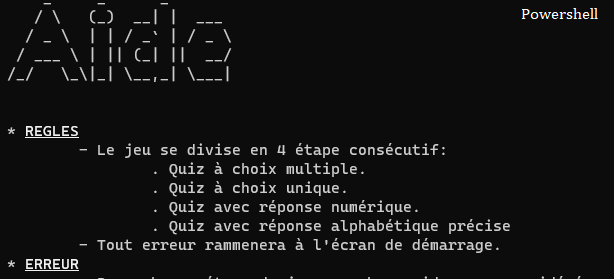

# TECHZARA_WCC2_s3

# APPLICATION NAME
- Teknium Quiz

## Description
- Quiz App, build in python with several handling error.

## Prerequisites : 

- Python `3.8` or latest. You can get it [here](https://www.python.org/downloads/).
- Powershell if running in windows.

## Installation
- Open bash command in the main directory (we recommended using powershell if windows user).

-  Copy the following command in the powershell:
```
pip install -r requirements.txt
```
## Runnig
- In the powershell bash type:
```
python main.py
```

## PowerShell VS CMD 
<div>
  
  
</div>


